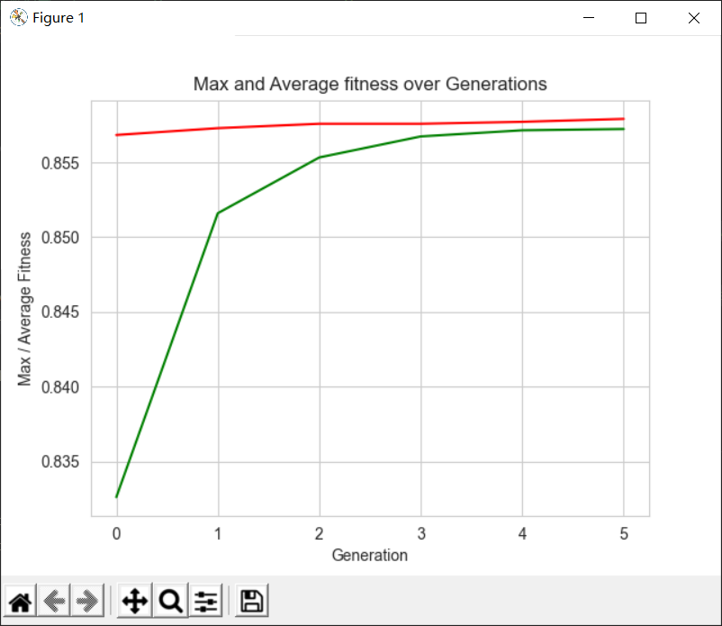
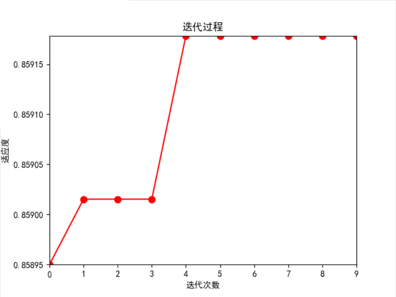
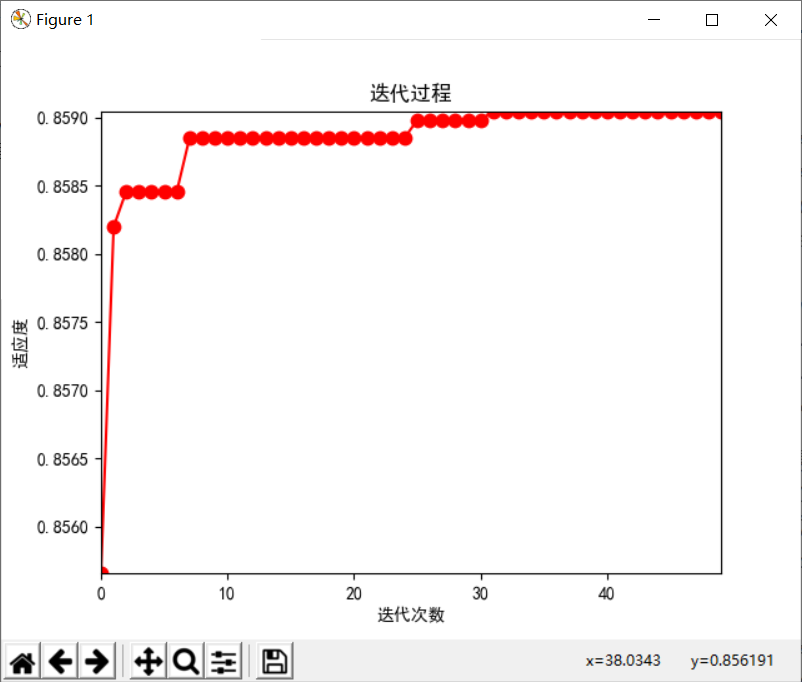
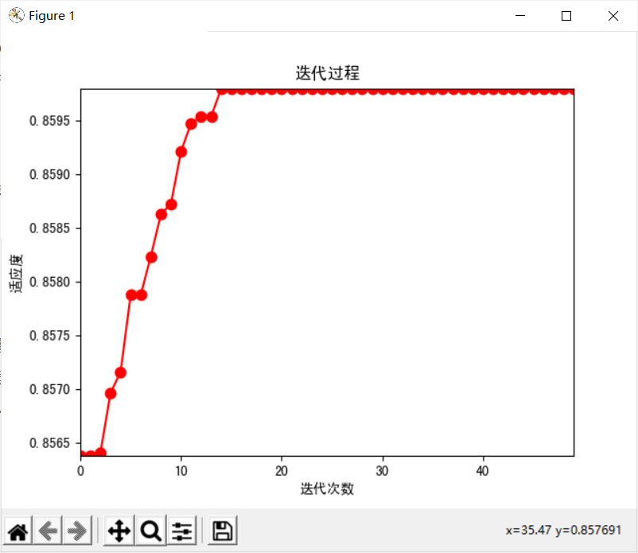

# Adult数据集分类结果

## Grid Search

> best parameters:  {'algorithm': 'SAMME.R', 'learning_rate': 1.0, 'n_estimators': 100}
> best score:  0.8596022171503097
> Time Elapse: 943.3204729557037

## Grid Search Based GA

> Best individual is: {'n_estimators': 100, 'learning_rate': 1.0, 'algorithm': 'SAMME.R'}
> with fitness: 0.8596022171503097
> Time Elapsed =  528.7194740772247

## GA

> POPULATION_SIZE = 20
>
> P_CROSSOVER = 0.9  # probability for crossover
>
> P_MUTATION = 0.3  # probability for mutating an individual
>
> MAX_GENERATIONS = 5
>
> HALL_OF_FAME_SIZE = 5
>
> CROWDING_FACTOR = 20.0  # crowding factor for crossover and mutation

> Best solution is: 
> params =  'n_estimators'= 91, 'learning_rate'=0.742, 'algorithm'=SAMME.R
> Accuracy = 0.85791
>
> 

### 结果：

## PSO

### 结果：

1. > MAX_Generation = 10		#迭代次数
   > Population = 10			#种群数量
   >
   > v_low = -1
   >
   >   v_high = 1
   >
   > c1 = 2.0  # 学习因子
   > c2 = 2.0
   > w = 0.8
   >
   > ---------------------------

   > 当前最佳位置：[98.38612708  0.87590522  0.56149847]
   > 0.8591783501793284
   > 当前的最佳适应度：0.8591783501793284
   > time cost:       1941.0392363071442

2. > ################ 改变迭代次数和种群大小#######################
   >
   > MAX_Generation = 50		#迭代次数
   > Population = 20			#种群数量
   >
   > v_low = -1
   >
   >  v_high = 1
   >
   > c1 = 2.0  # 学习因子
   > c2 = 2.0
   > w = 0.8

   > 当前最佳位置：[89.82201383  0.82092164  0.51607745]
   > 0.8590479295728726
   > 当前的最佳适应度：0.8590479295728726
   > time cost:       19768.351210832596	s
   >

3. > MAX_Generation = 50		#迭代次数
   > Population = 10			#种群数量
   >
   > v_low = -1
   >
   > v_high = 1
   >
   > c1 = 2.0  # 学习因子
   > c2 = 2.0
   > w = 0.8

   > 当前最佳位置：[97.61315258  1.          1.        ]
   > 当前的最佳适应度：0.8597978480599935
   > time cost:	 4288.910015821457 	s
   >
   > 