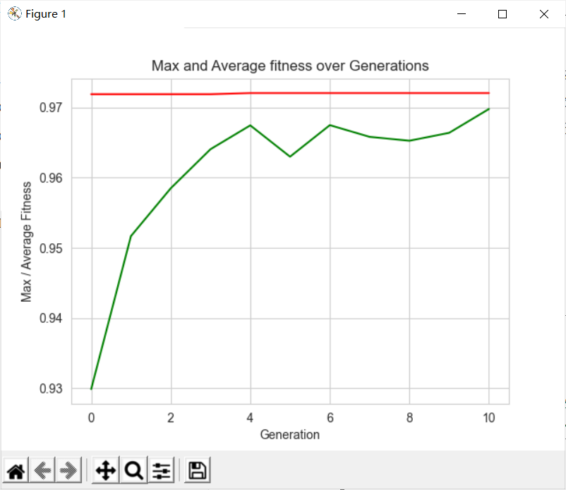
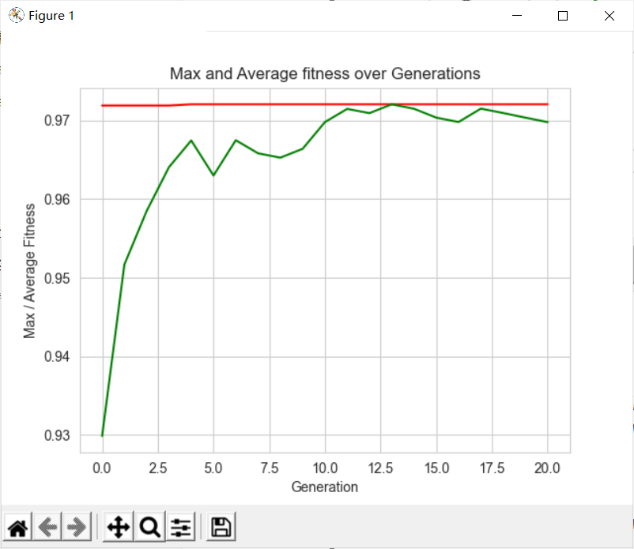
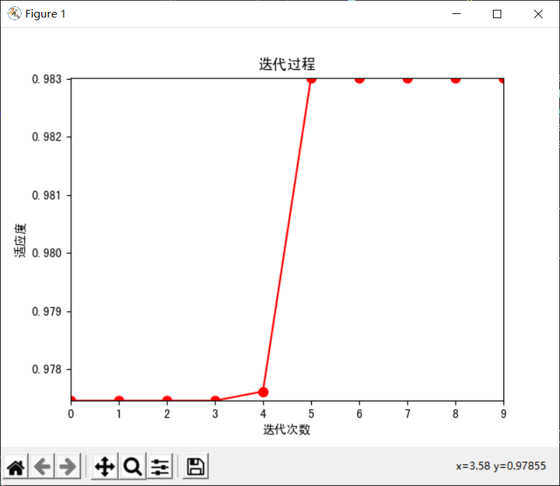
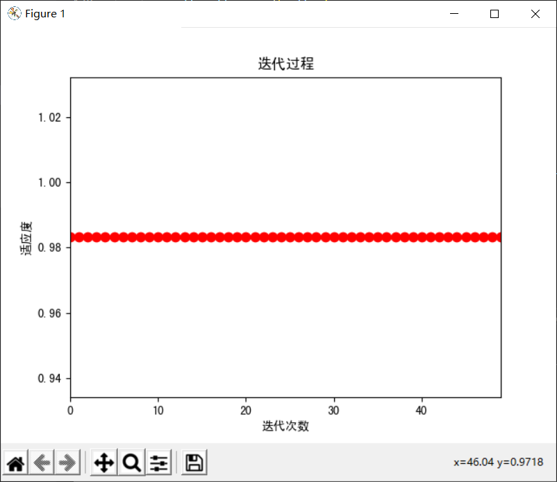
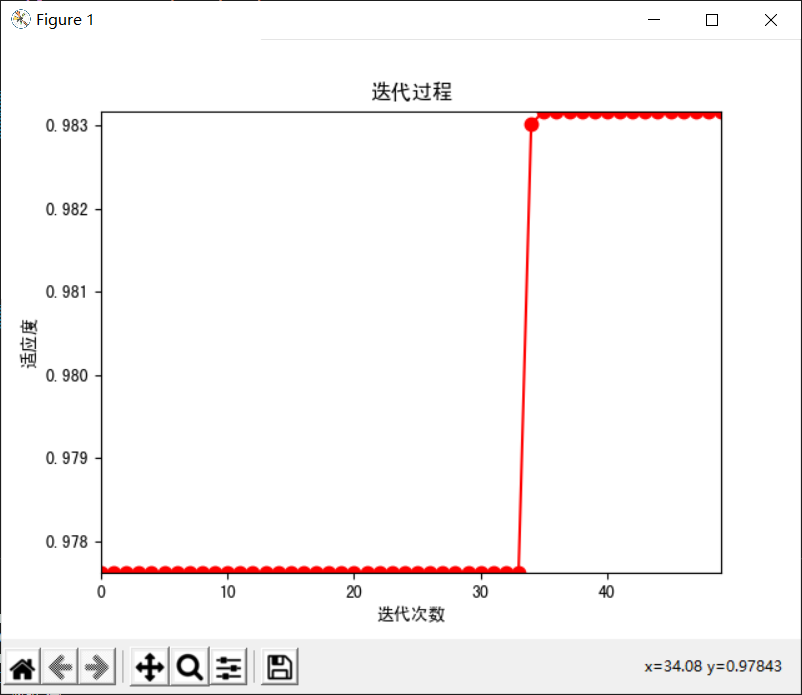
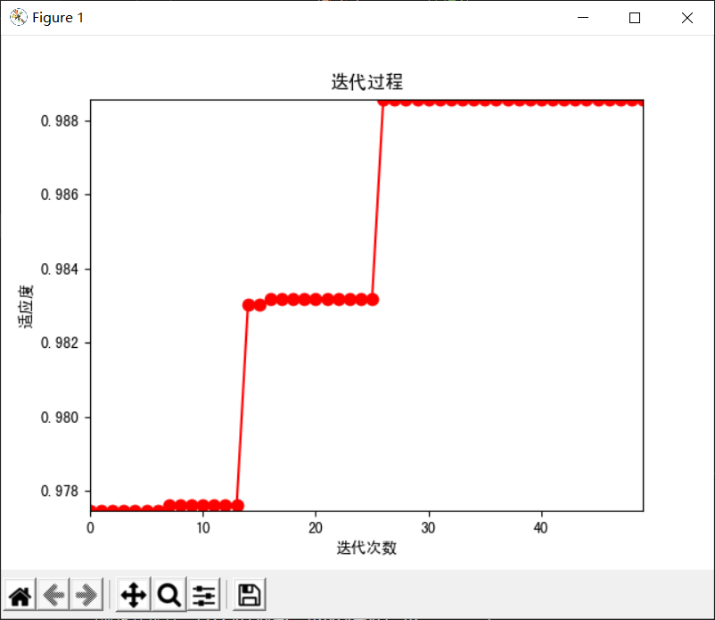
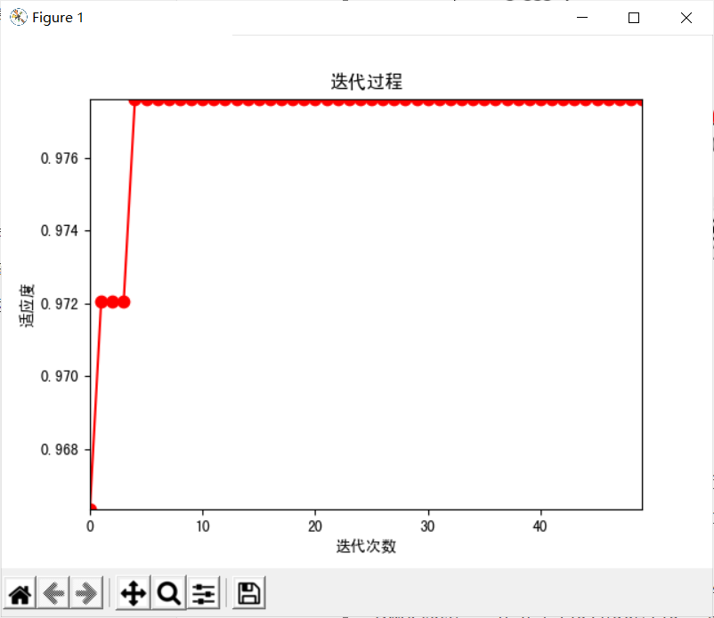
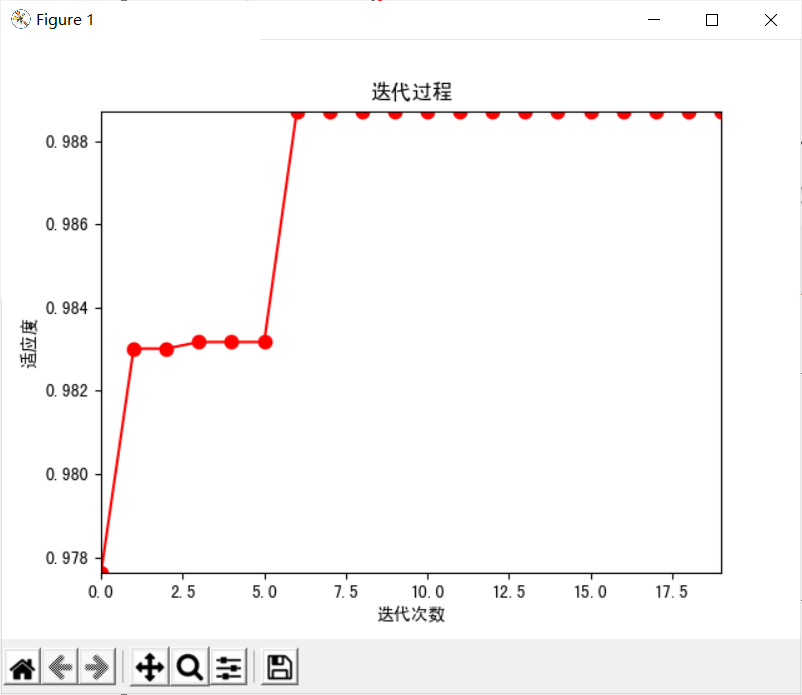
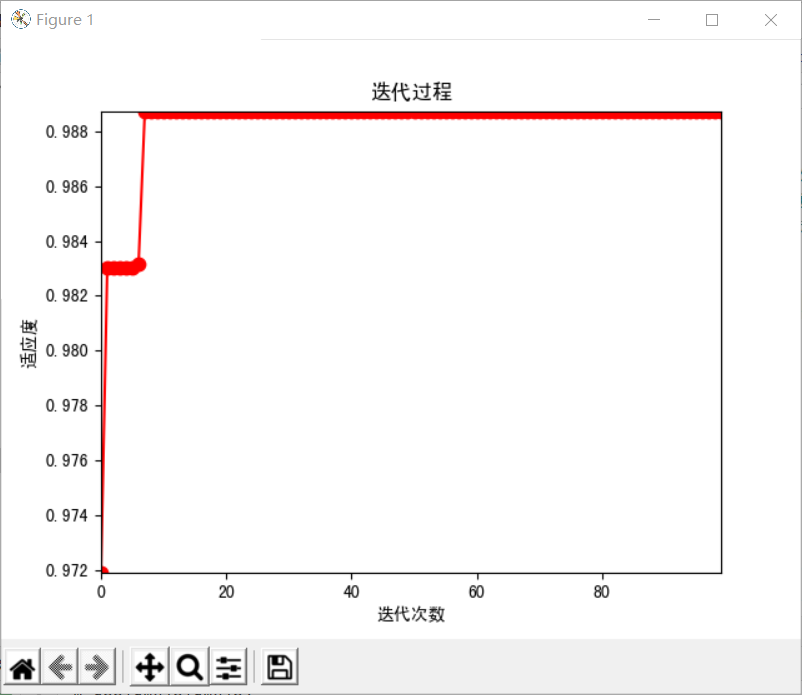

# wine数据集分类结果

## Grid Search

> best parameters:  {'algorithm': 'SAMME', 'learning_rate': 0.3593813663804626, 'n_estimators': 60}
> best score:  0.9720634920634922
> Time Elapse: 113.00295925140381

## Grid Search Based GA

> Best individual is: {'n_estimators': 100, 'learning_rate': 0.3593813663804626, 'algorithm': 'SAMME'}
> with fitness: 0.9719101123595506
> Time Elapsed =  46.56487488746643

## GA

### 结果：

1. > ```python
   > POPULATION_SIZE = 10
   > P_CROSSOVER = 0.9  # probability for crossover
   > P_MUTATION = 0.5   # probability for mutating an individual
   > MAX_GENERATIONS = 10
   > HALL_OF_FAME_SIZE = 5
   > CROWDING_FACTOR = 20.0  # crowding factor for crossover and mutation
   > ```

   > Best solution is: 
   > params =  (67, 0.34684801135281196, 'SAMME')
   > Accuracy = 0.97206
   >
   > 

2. > POPULATION_SIZE = 10
   > P_CROSSOVER = 0.9  # probability for crossover
   > P_MUTATION = 0.5   # probability for mutating an individual
   > MAX_GENERATIONS = 10
   > HALL_OF_FAME_SIZE = 5
   > CROWDING_FACTOR = 20.0  # crowding factor for crossover and mutation

   > Best solution is: 
   > params =  (67, 0.34684801135281196, 'SAMME')
   > Accuracy = 0.97206
   >
   > 

## PSO

### 算法大致步骤：

* 初始化
* 更新

可参考的blog：[(87条消息) 智能优化算法——粒子群算法原理与仿真程序_子木呀的博客-CSDN博客_粒子群优化算法原理](https://blog.csdn.net/qq_41687938/article/details/122641718)

### 代码实现设置的条件：

```python
MAX_Generation = 10		#迭代次数
Population = 10			#种群数量
dimension = 3
v_low = -1
v_high = 1
pso = PSO(dimension, MAX_Generation, Population,
              BOUNDS_LOW, BOUNDS_HIGH, v_low, v_high) #实现的class
```

### 更新步骤的核心代码:

网上搜一下，其中w自身权重系数（记不清了），c1是个体学习系数，c2是群落学习系数

```python
c1 = 2.0  # 学习因子
c2 = 2.0
w = 0.8
# 更新速度(核心公式)
self.v[i] = w * self.v[i] + c1 * random.uniform(0, 1) * (
    self.p_best[i] - self.x[i]) + c2 * random.uniform(0, 1) * (self.g_best - self.x[i])
# 速度限制
for j in range(self.dimension):
    if self.v[i][j] < self.v_low:
        self.v[i][j] = self.v_low
    if self.v[i][j] > self.v_high:
        self.v[i][j] = self.v_high

# 更新位置
self.x[i] = self.x[i] + self.v[i]
# 位置限制
for j in range(self.dimension):
    if self.x[i][j] < self.bound[0][j]:
        self.x[i][j] = self.bound[0][j]
    if self.x[i][j] > self.bound[1][j]:
        self.x[i][j] = self.bound[1][j]
```

大致的意思就是通过公式更新速度和位置，同时对更新后的速度与位置进行修正，因为更新的位置一定是在一定的范围之内的。

### 结果：

1. > MAX_Generation = 10		#迭代次数
   > Population = 10			#种群数量
   >
   > v_low = -1
   >
   >   v_high = 1
   >
   > c1 = 2.0  # 学习因子
   > c2 = 2.0
   > w = 0.8
   >
   > ---------------------------
   
   > n_estimators'=97.59544738, 'learning_rate'=0.93788895, 'algorithm'=SAMME
   > 0.9830158730158731
   > 当前的最佳适应度：0.9830158730158731
   > time cost:       175.3606903553009
   >
   > 
   
2. > ################ 改变迭代次数和种群大小#######################
   >
   > MAX_Generation = 50		#迭代次数
   > Population = 20			#种群数量
   >
   > v_low = -1
   >
   >  v_high = 1
   >
   > c1 = 2.0  # 学习因子
   > c2 = 2.0
   > w = 0.8
   
   > 当前最佳位置：[22.63664273  0.7580015   0.39425009]
   > 0.9831746031746033
   > 当前的最佳适应度：0.9831746031746033
   > time cost:        1097.9579124450684      s
   >
   > 

3. > ################ 改变速度大小#######################
   >
   > MAX_Generation = 50		#迭代次数
   > Population = 20			#种群数量
   >
   > v_low = -0.5
   >
   >  v_high = 0.5
   >
   > c1 = 2.0  # 学习因子
   > c2 = 2.0
   > w = 0.8
   >
   > 

   > 当前最佳位置：[7.49302006e+01 6.20588351e-01 2.87210702e-02]
   > 0.9831746031746033
   > 当前的最佳适应度：0.9831746031746033
   > time cost:       1510.600219488144      s

4. > ################ 改变速度范围#######################
   >
   > MAX_Generation = 50		#迭代次数
   > Population = 20			#种群数量
   >
   > v_low = [-10, -0.1, -0.5]
   >
   > v_high = [10, 0.1, 0.5]
   >
   > c1 = 2.0  # 学习因子
   > c2 = 2.0
   > w = 0.8

   > 当前最佳位置：[17.96950042  0.88984003  0.        ]
   > 0.9885714285714287
   > 当前的最佳适应度：0.9885714285714287
   > time cost:       1343.2985899448395     s
   >
   > 

5. > 改变初始化

   > 当前最佳位置：[58.67594087  0.40936569  0.        ]
   > 0.9776190476190475
   > 当前的最佳适应度：0.9776190476190475
   > time cost:       2636.623948097229      s
   > 
   > 

6. > ```python
   > MAX_Generation = 20
   > Population = 100
   > dimension = 3
   > v_low = [-5, -0.1, -0.5]
   > v_high = [5, 0.1, 0.5]
   > c1 = 2.0  # 学习因子
   > c2 = 2.0
   > w = 0.8  # 自身权重因子
   > ```

   > 当前最佳位置：[68.4582005   0.934788    0.29785363]
   > 当前的最佳适应度：0.9887301587301588
   > time cost:	 846.2582359313965 	s
   >
   > 

7. >   MAX_Generation = 100
   > Population = 20
   > dimension = 3
   > v_low = [-5, -0.1, -0.5]
   > v_high = [5, 0.1, 0.5]
   > c1 = 2.0  # 学习因子
   > c2 = 2.0
   > w = 0.8  # 自身权重因子

   > 当前最佳位置：[18.48899119  0.78257239  0.        ]
   > 当前的最佳适应度：0.9887301587301588
   > time cost:	 330.937979221344 	s
   >
   > 